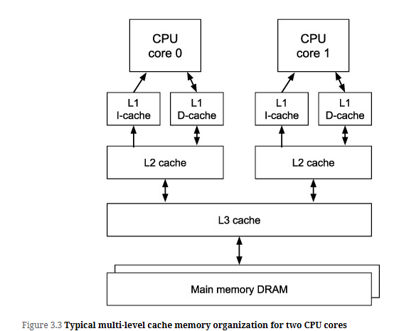

Second fundamental resource to measure is memory access latency—how long do real computer reads and writes take, for each level of the memory hierarchy

Different design layers interact to produce memory access patterns -
- C programmer
- Compiler
- Assembly language
- CPU instructions
- Virtual memory
- Several levels of cache memory
- Main-memory 

# Cache Organization
Today’s datacenter CPUs have a memory hierarchy consisting of several layers of cache memory plus a very large main memory, as shown in Figure 3.3. Each physical CPU core in a multicore processor chip has its own Level-1 instruction (L1i) and data (L1d) caches, each built out of very fast SRAM cells. These caches can usually access a new memory word or even two words every CPU cycle, with cycle times now around 0.3 nsec, about 250 times faster than the original 80 nsec cache in the IBM 360/85

# References

